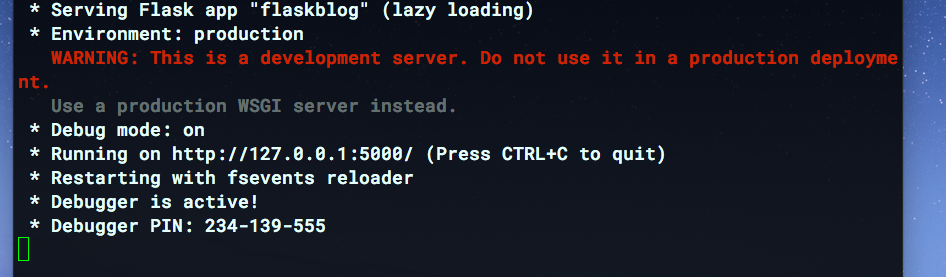
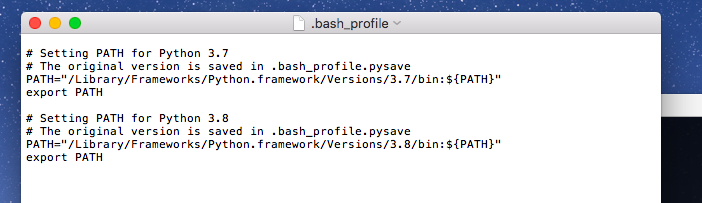

# EverPost


A blog post app similar to Twitter where users can register, log in, create posts, read posts, 
like posts, edit their posts, delete their posts, change the font and font color of their posts,
have an admin validate their posts, change their profile picture and request a password reset email
which will be sent to their registered Gmail account.

Please consider starring the repository if you liked it.

# **How to clone repository**

If you want to clone the repository and try it 
out on your own computer, follow the steps 
mentioned below. All the features of the app mentioned 
above will work except for the password reset email feature, which
will not work now due to security reasons. I will be editing this readme to 
also have instructions on how to enable the reset password feature as well.

_If you find an issue with the application - mention it [here.](https://github.com/Whitespace404/EverPost/issues/new)_


# Mac OS 
The installation proccess for Mac is 
mentioned below.

## Prerequisites

### 1) Python 3.6+
Download from [here](https://www.python.org/)

Macs already come with **Python2**. This version of Python is not supported by this application.
You will have to download a version of Python that is higher than __Python 3.6__. 

If you want to check which version of Python you have, simply type in:

```bash
python3 --version
python --version
```

```bash
git clone https://github.com/Whitespace404/Blog_Post_App.git
cd Blog_Post_App
pip3 install -r requirements.txt 
python3 run.py
```

If you followed all the steps above correctly,
you should see something similar to this in your Terminal 
window after you have executed the last command:
  


Minimize the Terminal window and visit localhost:5000/ to see the application. If that doesn't work, click 
<a href="http://127.0.0.1:5000/">here
</a>

Once you are done using the application, you can press Control + C if you want to stop the running server.

---

## Password Reset
All features of the application will work except for the password reset feature, 
which I have disabled due to security reasons because the application signs in to my account to 
send an email to the user that requested the password reset.

If you want to enable it, press Control + C to stop the running server and type in:

```bash
  cd ~
  open -a TextEdit .bash_profile
```

A window that looks similar to this will open up:



Simply type in the following lines at the end and replace the placeholders with their values.

```
EMAIL_ID="[enter_your_email_id_here]"
EMAIL_PWD="[enter_your_email_password_here]"
```

Example:

```
EMAIL_ID="HOPEFULLYdoesnotexist@example.com"
EMAIL_PWD="02ca3466a4"
```


Save the file and then restart your Terminal, then run the application again by typing:

```bash
cd Blog_Post_App
python3 run.py
```

**If you do not feel comfortable entering your Email password, it is totally fine. All features of the app will work except for the Password Reset Feature.**


###### instructions for Windows password reset coming soon..

---
# Windows
The installation for Windows is a little
bit different from the process that Mac users might follow
but that is explained here as well.
### Prerequisites

#### 1) GitBash Terminal.
Download from [here](https://git-scm.com/downloads).
We will be using Git to clone the repository 
from GitHub. If you know how to download a Zip file
of this repository, then you are welcome to do so that way.

#### 2) Python 3.6+
Download from [here](https://www.python.org/).
If you think you already have a version of Python and don't know which version of Python it is, simply execute the following command:
```bash
python --version
```

---

Once you have downloaded and installed the prerequisites, run the following commands from GitBash Terminal:

```
git clone https://github.com/Whitespace404/Blog_Post_App.git
cd Blog_Post_App
pip install -r requirements.txt 
python run.py
```
  
If you followed all the steps above correctly,
you should something similar this in your terminal 
window after you have executed the last command:


Minimize the Terminal window and visit localhost:5000/ to see the application. If that doesn't work, click 
<a href="http://127.0.0.1:5000/">here
</a>

Once you are done using the application, you can press Control + C if you want to stop the running server.

